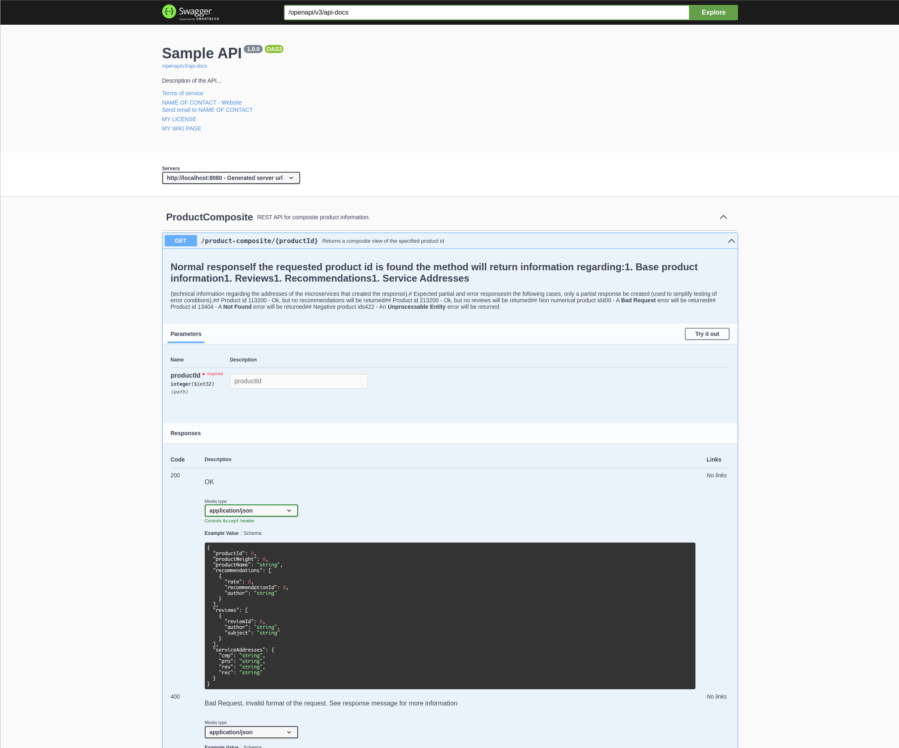

= Microservices with Spring Boot and Spring Cloud, 2nd Edition

IMPORTANT: Links

. https://c4model.com/[C4 Annotation Model]
. https://github.com/spring-cloud?q=binder[Spring Cloud Stream]
. https://camel.apache.org/[Apache Camel]
. https://dzone.com/articles/calling-rest-api-from-camel-route[Calling REST APIs From Camel Routes]
. https://github.com/PacktPublishing/Microservices-with-Spring-Boot-and-Spring-Cloud-2E[Microservices-with-Spring-Boot-and-Spring-Cloud-2E]
. https://mkyong.com/spring-boot/spring-boot-slf4j-logging-example/[Spring Boot SLF4j Logback example]
. https://camel.apache.org/components/latest/http-component.html[Apache Camel HTTP Component]
. https://stackoverflow.com/questions/56320109/spring-controller-is-not-supporting-serverhttprequest[HttpServerRequest Bug]
. https://reflectoring.io/spring-boot-docker/[Creating Optimized Docker Images for a Spring Boot Application]
. http://localhost:8080/openapi/v3/api-docs[General Product Composite Service Information]
. http://localhost:8080/openapi/webjars/swagger-ui/index.html?configUrl=/openapi/v3/api-docs/swagger-config[Product Composite Service OpenAPI Documentation]
. https://mapstruct.org/[Map Struct]
. https://stackoverflow.com/questions/47676369/mapstruct-and-lombok-not-working-together[MapStruct and Lombok not working together]
. https://www.2ndquadrant.com/en/blog/building-reactive-postgresql-repositories-for-spring-boot-applications-part-1/[Building Reactive PostgreSQL Repos]
. https://stackoverflow.com/questions/71966221/spring-api-gateway-m1-java-lang-unsatisfiedlinkerror-no-netty-resolver-dns-n[Spring Boot Netty UnsatisfiedLinkError macOS M1 Netty]

== Introduction to Microservices

* Some benefits when decomposing the platform's functionality into a set of autonomous software components
. A customer can deploy parts of the platform in its own system landscape, and integrating it with its existing system/sub using its well-defined APIS

* Defining a Microservice
. Fast development, enabling continuous deployments
. Easier to scale, manually or automatically
. Essentially is an autonomous piece of software component that is independently upgradeable, replaceable and scalable

* Challenges
. *_chain of failures_*
. Keep Configuration centralized
. Logging and traceability in many small components (Keep the Tracking)
. Hardware resources monitoring

* The 8 fallacies about distributed computing:
. The network is reliable
. Latency is zero
. Bandwidth is infinite
. The network is secure
. Topology doesn't change
. There is one administrator
. Transport cost is zero
. The network is homogeneous

* Design Patterns for Microservices
. Service Discovery
. Edge Server
. Reactive Microservices
. Central Configuration
. Centralized log analysis
. Distributed tracing
. Circuit Breaker
. Control loop
. Centralized monitoring and alarms

.Software Enablers
,=== Design Pattern,Spring Boot,Spring Cloud,Kubernetes,Istio
*Service Discovery*,,Netflix Eureka and Spring Cloud LoadBalancer,Kubernetes kube-proxy and service resources,
*Edge Server*,,Spring Cloud and Spring Security OAuth, Kubernetes Ingress Controller,
*Reactive microservice*,Project Reactor and Spring Webflux using Apache Camel to manage and mediate all integrations,,,
*Central Configuration*,,Spring Config Server,Kubernetes ConfigMaps and Secrets,
*Centralized log analysis*,,,Elasticsearch Fluentd and Kibana Note: Actually not part of K8s but can easily be deployed and configured with Kubernetes,
*Distributed tracing*,,Spring Cloud Sleuth and Zipkin,,Jaeger
*Circuit breaker*,,Resilience4j,,Outlier detection,
*Control loop*,,Kubernetes controller managers,
*Centralized monitoring and alarms*,,,,Kiali or Grafana and Prometheus ,===

== Using Junit Jupter to Tests

[source,java]
----
import org.junit.jupiter.api.BeforeEach;
import org.junit.jupiter.api.Test;
----

== Maven Test specific class

[source,bash]
----
mvn clean test -Dtest=MyClassTest
----

== Compile Lib Util/Api in local repo using maven

[source,bash]
----
mvn clean -DskipTests compile package
mvn install:install-file -Dfile=./target/api-1.0-SNAPSHOT.jar \
  -DgroupId=com.packtpub.microservices.springboot.apis \
  -DartifactId=apis -Dversion=1.0-SNAPSHOT -Dpackaging=jar \
  -DgeneratePom=true

mvn install:install-file -Dfile=./target/utils-1.0-SNAPSHOT.jar \
  -DgroupId=com.packtpub.microservices.springboot.utils \
  -DartifactId=utils -Dversion=1.0-SNAPSHOT -Dpackaging=jar \
  -DgeneratePom=true
----

[source,java]
----
@SpringBootApplication
public class MyApplication {
  public static void main(String... args) {}
}

@Component
public class MyComponentImpl implements MyComponent {}

@Component
public class MyAnotherComponentImpl implements MyAnotherComponent {
  private final MyComponent myComponent;
  @Autowired
  public MyAnotherComponentImpl(MyComponent myComponent) {
    this.myComponent = myComponent;
  }
}
----

[source,java]
----
import org.apache.camel.CamelContext;
import org.apache.camel.ProducerTemplate;
import org.apache.camel.builder.AdviceWith;
import org.apache.camel.component.mock.MockEndpoint;
import org.apache.camel.test.spring.junit5.CamelSpringBootTest;
import org.junit.jupiter.api.Test;

import org.springframework.beans.factory.annotation.Autowired;
import org.springframework.boot.test.context.SpringBootTest;

@SpringBootTest
@CamelSpringBootTest
public class ProductAppTests {

	@Autowired
	private CamelContext camelContext;

	@Autowired
	private ProducerTemplate producerTemplate;

	@Test
	public void test() throws Exception {
		MockEndpoint mock = camelContext.getEndpoint("mock:stream:out", MockEndpoint.class);

		AdviceWith.adviceWith(camelContext, "hello",
				// intercepting an exchange on route
				r -> {
					// replacing consumer with direct component
					r.replaceFromWith("direct:start");
					// mocking producer
					r.mockEndpoints("stream*");
				}
		);

		// setting expectations
		mock.expectedMessageCount(1);
		mock.expectedBodiesReceived("Hello World");

		// invoking consumer
		producerTemplate.sendBody("direct:start", null);

		// asserting mock is satisfied
		mock.assertIsSatisfied();
	}
}

----

== Land space of Microservices

. Product Service
- Port 7001

[source,json]
----
{
  "productId": "x",
  "productName": "xxx",
  "productWeight": "xxx"
}
----

. Review Service
- Port 7003

[source,json]
----
{
  "productId": "x",
  "reviewId": "xxx",
  "author": "xx",
  "subject": "xxx",
  "content": "xxx"
}
----

. Recommendation Service
- Port 7002

[source,json]
----
{
  "productId": "x",
  "recommendationId": "xxx",
  "author": "xx",
  "rate": "xxx",
  "content": "xxx"
}
----

. Product Composite Service
- Port 7000

[source,json]
----
{
  "productInformation": "x",
  "reviews": [],
  "recommendations": []
}
----

. Product Composite Service create Aggregate
- Port 7000

[source,json]
----
{
    "productId": 123,
    "productWeight": "34",
    "productName": "Anchor",
    "recommendations": [
        {
            "rate": "2",
            "recommendationId": 2,
            "author": "Joseph Stratus",
            "content": "No Content"
        },
        {
            "rate": "3",
            "recommendationId": 2,
            "author": "Joseph Stratus",
            "content": "No Content"
        }
    ],
    "reviews": [
        {
            "reviewId": 123,
            "author": "Craus T2",
            "subject": "No Time",
            "content": "No Content"
        }
    ]
}
----

* This service aggregates information from the three core services

[source,bash]
== Limiting available CPUs

----
$ echo 'Runtime.getRuntime().availableProcessors()' | docker run --rm -i azul/zulu-openjdk-alpine:17.0.0 jshell -q

$ echo 'Runtime.getRuntime().availableProcessors()' | docker run --rm -i --cpus=3 azul/zulu-openjdk-alpine:17.0.0 jshell -q
----

== Limiting available memory & Docker Commands

[source,bash]
----
$ docker run -it --rm azul/zulu-openjdk-alpine:17.0.0 java --XX:+PrintFlagsFinal | grep "size_t MaxHeapSize"
$ docker run -it --rm -m=1024M azul/zulu-openjdk-alpine:17.0.0 java -Xmx=600m --XX:+PrintFlagsFinal -version | grep "size_t MaxHeapSize"
$ docker build -t product-service .
$ docker run --rm -p 8080:8080 -e "SPRING_PROFILES_ACTIVE=docker" product-service
$ docker logs container_name --tail 0 -f
$ docker-compose up -d --build
$ docker-compose logs -f
----

== Curl & Postman Endpoints

[source,json]
----
{
  "endpoints": [
    {"product_composite":  "http://localhost:8080/product-composite/123"}
  ]
}
----

.Sample Swagger-ui with Execution

